# 一、 第一章：太康处方：1，太康处方接口点创建处方后提示创建成功但单据编号为空的日清后再点

创建处方。

2，太康处方接口点创建处方提示库存不足原因是开方短条码不对  
3，太康处方开方过程和药品新增等等操作问题的可以在太康群反馈。

二、普仁处方：1，普仁处方接口点创建处方提示库存不足或者商品无对应关系，先做零售药方登记 ，再把商品短条码发信息群，信息部处理后避免下次再出现。

2，普仁要做零售药方登记可以从普仁处方接口位置复制URL地址粘贴在浏览器快速下载处方图片。太康接口也有类似IMGURL地址可以快速下载处方图片。

三、智云处方：1，智云处方（银川）要先进后台网页门店管理-线下审方-点启用，这个启用了一次就可以了不要再动，如果未开启，那么就会提示“URL地址未下载，请重新下载!”

2，智云开处方要点扫码买药-手动输入-手输短条码。如果不是按手动输短条码会提示库存不足，并且智云是只能搜固定商品条码。

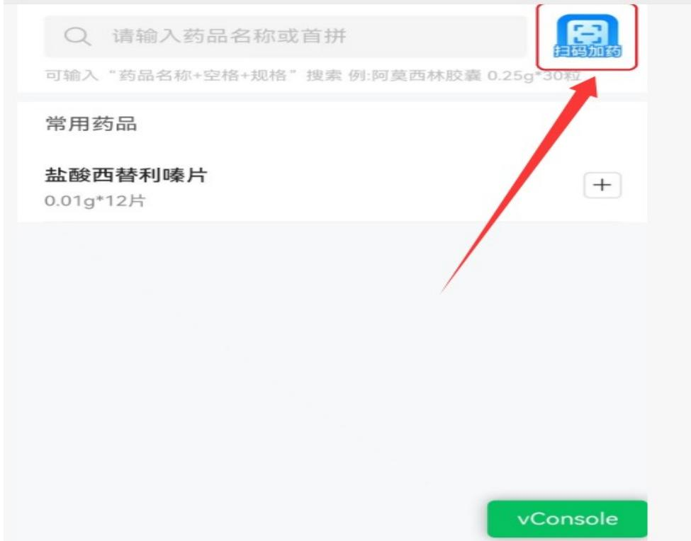

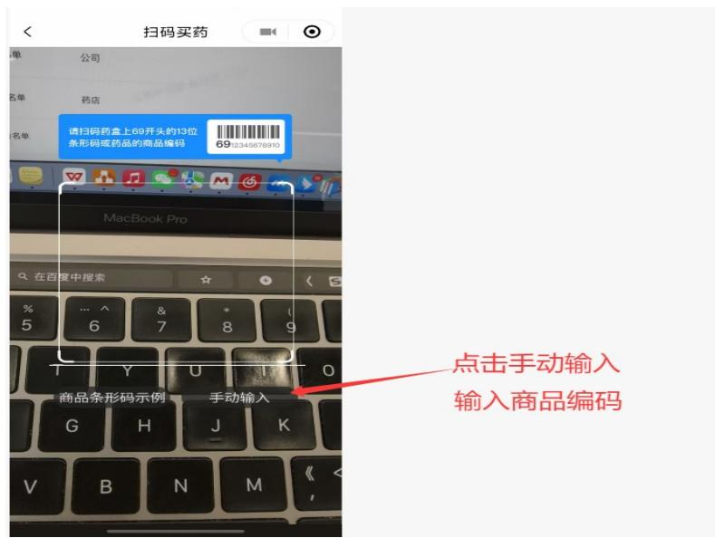

3，智云开方是省外医院平台，只能用于现金买单，不能用于医保买单。

我们用的平台只有智云这一个平台只能用现金，其他平台不限收银方式。

4，顾客自带处方并且是医保销售做零售药方登记被限制的药品（零售药方登记输条码提示无资料）区总审核处方后报信息部解开限制登记。

四、泰康同济处方：1，泰康同济处方是从智云网址下载泰康同济处方桌卡后扫码开方，注意和银川自费处方桌卡不要混淆。

2，泰康同济处方没有接口，只能从智云网址下载处方后做零售药方登记，此处方平台是备用处方平台，其他平台不能用时才用。  
3，泰康同济点下载处方图片要选择图片格式（JPG格式或者 PNG格

式），不能选第一个 PDF 格式。PDF 格式在儒信里面显示不了图片

四、儒信审方：1，儒信程序及时关注信息群最新版本，如果通知安装新版本马上操作安装。

2，新员工要扫二维码做签名后收银的处方单才有调剂发药签字。   
3，店内注册双职业药师的的调剂发药时职业药师不要选调剂，否则会没有调剂发药签名。

  
益生天济签名信息采集

# 第二章：常见问题解答

一、刷卡提示“读卡 $\mathsf { N } ^ { \prime \prime }$ ，电脑右下角的小7右键退出重进，如果还不行，把小7点开拉到最下面看不能读卡的原因。

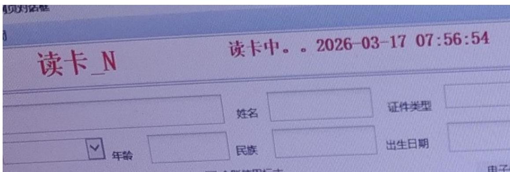

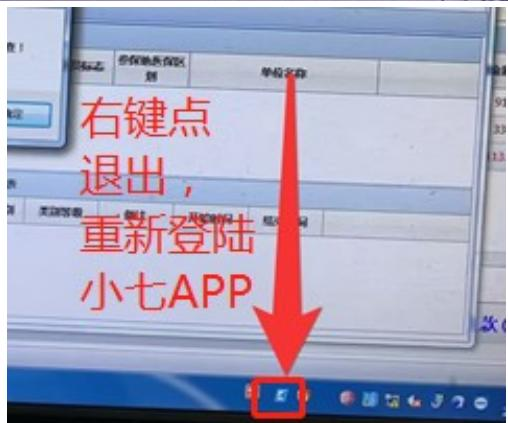

二、顾客不能刷卡看参保状态。读卡完成有一项参保状态数字分别代表不同状态

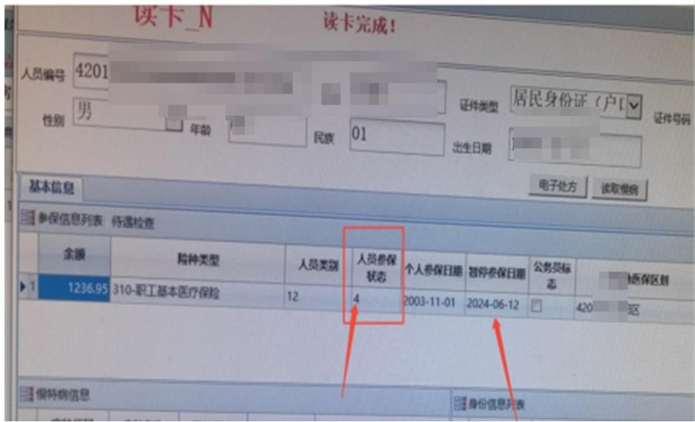

# 6.269人员参保状态(psn_insu_stas)

表1126人员参保状态  

<table><tr><td>代码值</td><td>代码名称</td><td>代码值</td><td>代码名称</td></tr><tr><td>0</td><td>未参保</td><td>1</td><td>正常参保</td></tr><tr><td>2</td><td>暂停参保</td><td>3</td><td>无效参保</td></tr><tr><td>4</td><td>终止参保</td><td></td><td></td></tr></table>

# 三、优惠金额误输数字会导致收银报错，需要把收银界面关掉重新输商品重新收。

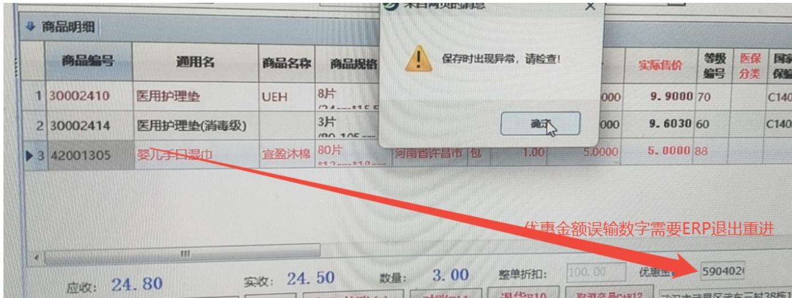

四、退货时，同一个商品有几盒的，如果买单时是扫追溯码出商品，那么退货时也是多行，一行对应一个码，需要试才知道其中哪一盒对应，扫对一盒放在一边。

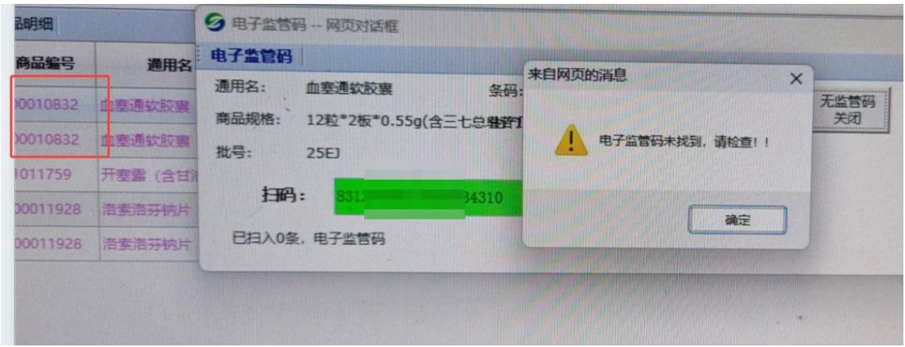

五、收银提处方时提示处方订单不允许新增，那么原因一般是开方短条码不对，点开处方明细检查条码。如果是扫69码出来的导致短条码不对，报在处方群里让工作人员核对修改商品资料。

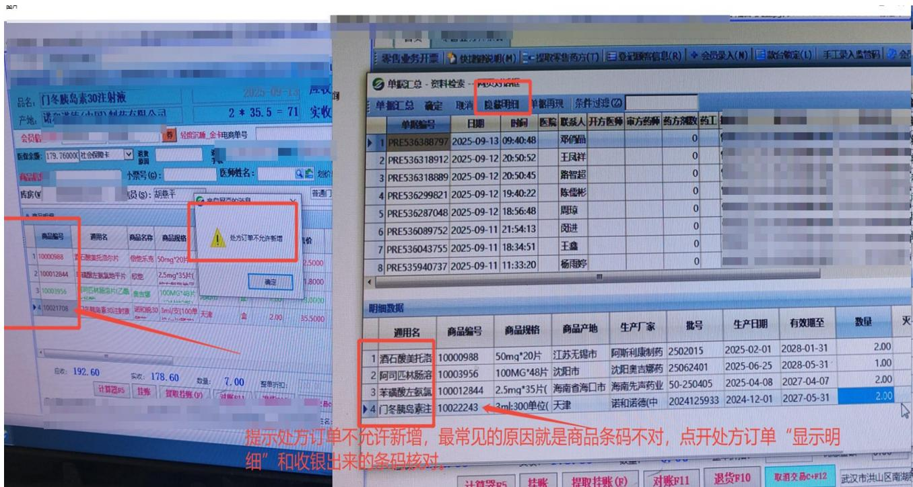

# 五、襄阳卡刷卡时提示：

卡号状态非正常，换卡未启用，身份证件信息不完整，没有符合条件的银行卡记录，卡号不存在，借方账户余额不足。就是要去当地工行处理

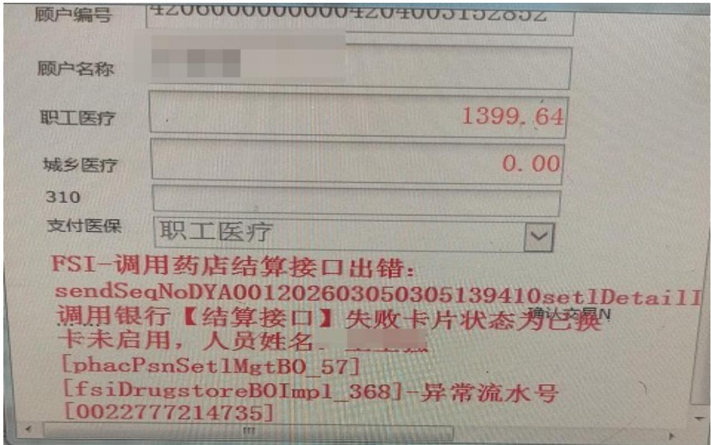

# 六、襄阳卡余额对不上的电话咨询 07103605237，小票显示的余额对不上时电

话咨询。（这种情况扣款是正确的）

# 七、刷卡提示读卡器连接错，拔插读卡器连电脑端的USB接口

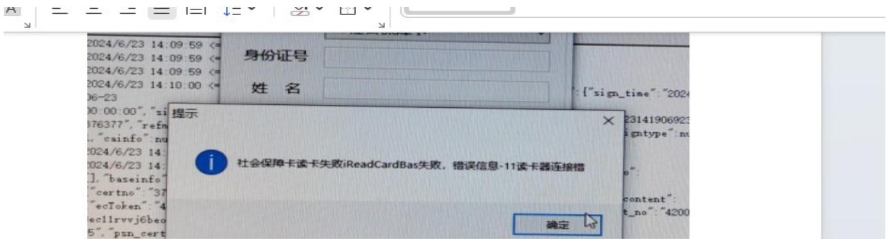

提示读卡器连接错就是拔插读卡器连电脑主机背后的USB接口（双头子带尾巴的主头子）

∗

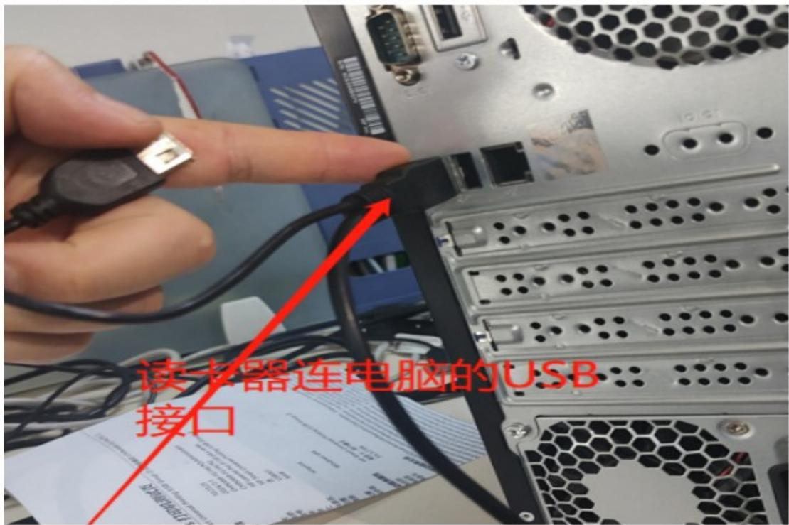

八、明泰读卡器和密码键盘的连接接口避免拔插，因为接口是针头的接口，万一脱落了要箭头对箭头插，如果没对准强行插就会把针头插弯，如果不紧容易松动就用电工胶布缠紧接头处。

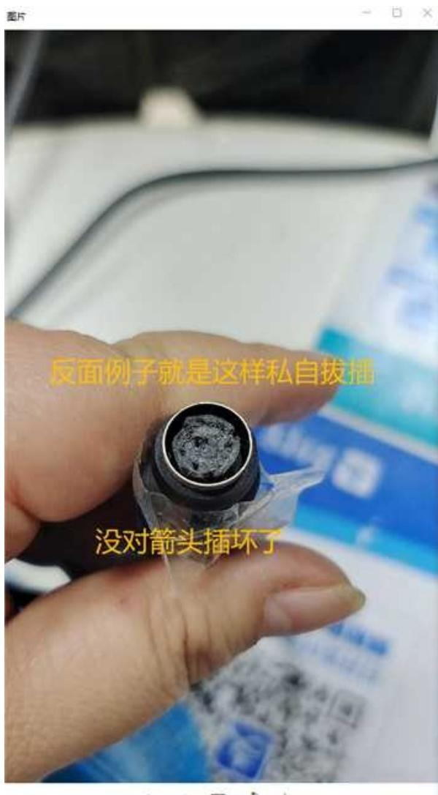

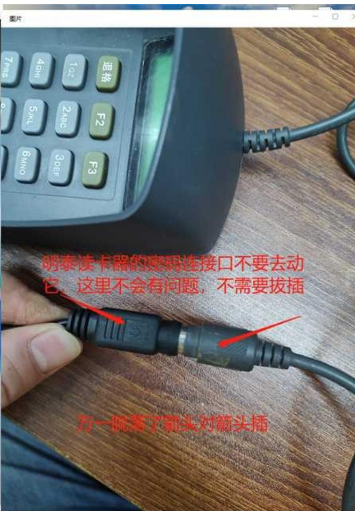

# 九、OA 电脑端网址和手机端服务器设置如下

http://192.168.10.41:7013/seeyon/main.do?method=main

m3.seeyon.com下载协同办公APP

进行服务器配置服务器

# 十、商业卡网址主页上有我们能用的商业卡所有网站、流程、卡样示例和账号密码。

http://172.29.131.101/syk/sykdl.html

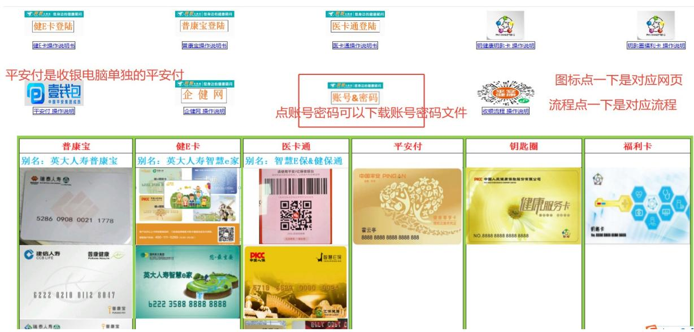

# 十一、有库存但是收银弹不出来的从商品结存查询-----批号处检查效期和是否停售标志。发现是停售的去检查质管部发的通知是否需要返仓。

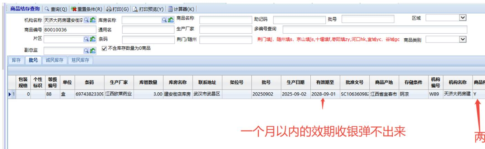

# 十二、单据冲突解决办法：解锁。

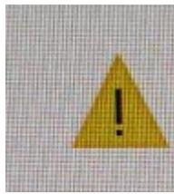

单据保护出错：单据【WCKWB0586715699】与他人冲突，操作无法完成！

#

#

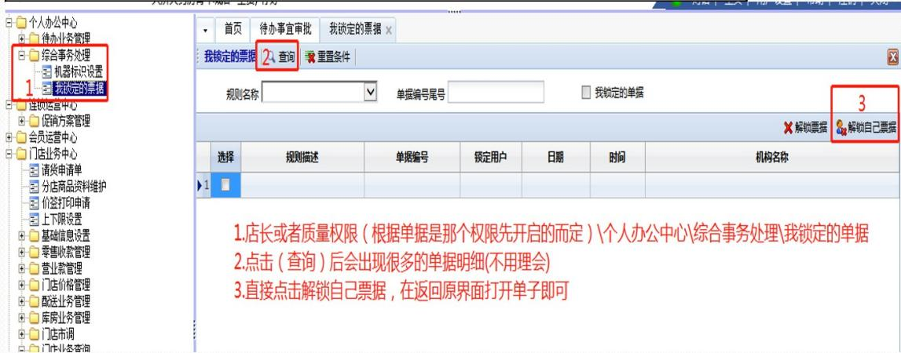

店长号锁的就去店长号解锁，质量号锁的就去质量号解锁。

十三、需要加减支付方式和支付方式调整顺序做支付方式规划，（新增-双击变红-确定-保存），支付序号重新排序后支付顺序变化了要告知店里其它人，避免他们不知道按习惯选错支付方式。

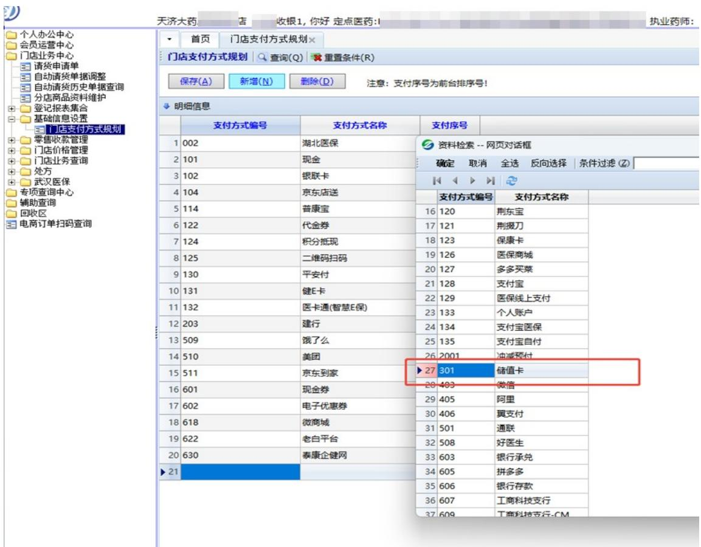

十四、企业微信空间占满电脑的按流程定期删除空间，按步骤清理时要退出企业微信。

十五、盘点前要检查电脑上历史单据，如果是有电脑端的历史盘点单未审核的自己删，已经审核了找信息部删。门店通的历史盘点单电脑上提出来之后右键删除明细，但是需要留一条明细才能执行，执行后重新盘那一个商品。盘点结束也在审核执行位置检查是否有遗留单据未处理。

# 十六、盘点前检查返仓占用。

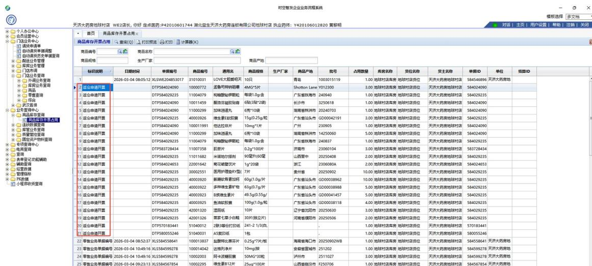

1，如果发现返仓单都已经接了减账了，但是返仓占用还有，说明返仓单做重复了，重复的返仓单没审核的自己删，已经审核了找开票室删（这一步最好在盘点前就检查做好，定期查看一下，避免在盘点时影响盘点准确）。  
2，返仓占用的商品盘点时不要加（盘这个商品时手机上不显示返仓占用掉的盒数，不要再去加上这个返仓占用的）。比如库存 10 个，返仓 2 个，返仓占用就是有 2 个数量，手机上盘点就显示 8 个，只盘 8 个。（要从返仓占用里面查确定是占用了 2 个）。

十七、激光打印机打价签容易卡纸的把价签的两边的圈圈撕掉再放在入打印机纸盒。

医保针打针头冬天容易运行不畅卡滞的在滑杆和齿轮出上缝纫机油后多滑动几次。

十八、ERP 服务器故障出现小人头的需要等 5 分钟后恢复。

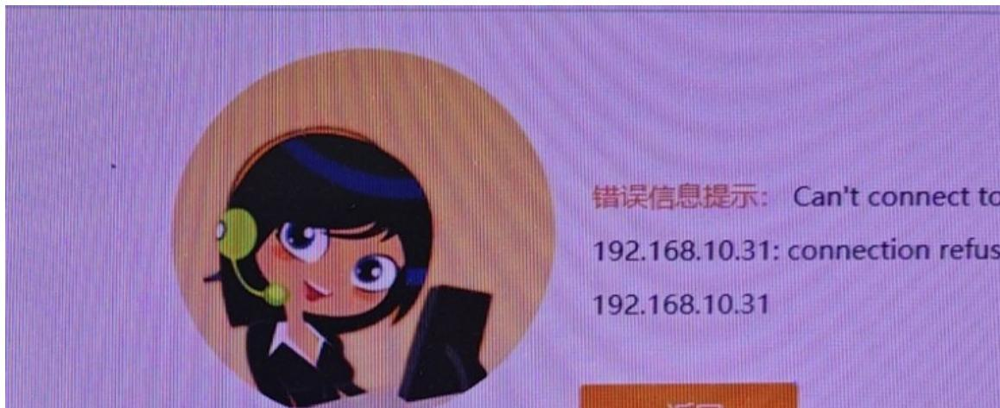

十九、ERP 长时间未操作被系统踢出来需要退出重进的提示：

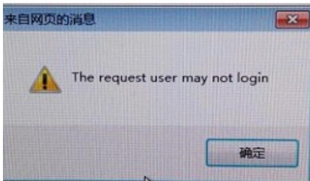

直接把ERP退出重进。

二十、电商扫追溯码提示重复（ERP 能扫不重复）的，在电商扫码查询里面查出来点删除已扫。（已经入账有单据编号的是删除不了的）。

正常入账的电商单顾客退款了的要提原单退。

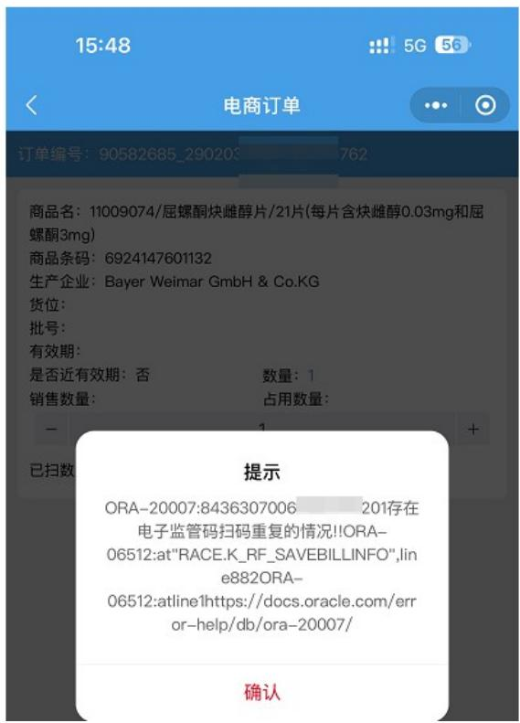

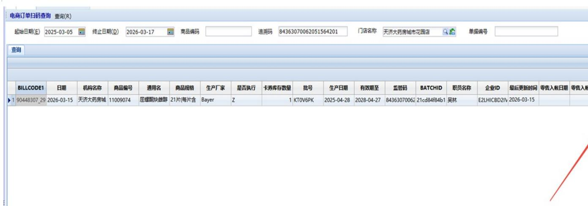

# 第三章：网络故障。

一、前后台和医保电脑分别是不同的设备控制的，控制前后台电脑网络的是普网光猫。

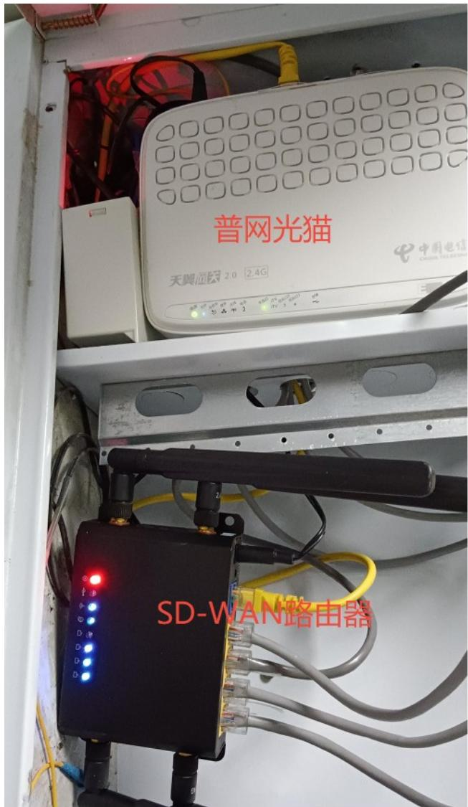

二、如果是信息部确定是普网坏了门店可以用“卡套”插手机卡（SD-WAN断电操作）恢复临时网络。

4，(插卡前把设备电源拔出断电！)然后已芯片面朝上，缺口朝里安装。如下

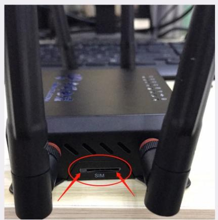

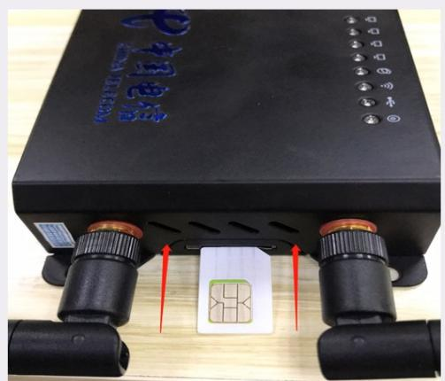

另外一款SD-WAN设备插卡方向

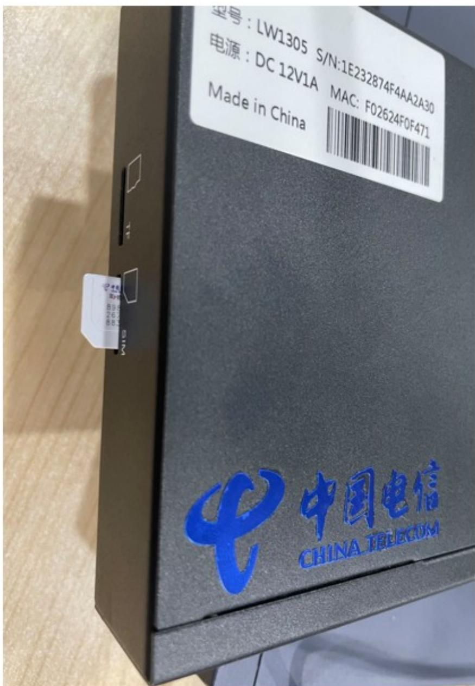  
A提取文字 。更多功能

三、医保电脑不能进ERP，小7也不能签到的，首先进医保电脑信息化服务平台看能不能进（医保电脑肯定是不能进其它外网的），如果不能进信息化平台，检查医保光猫。

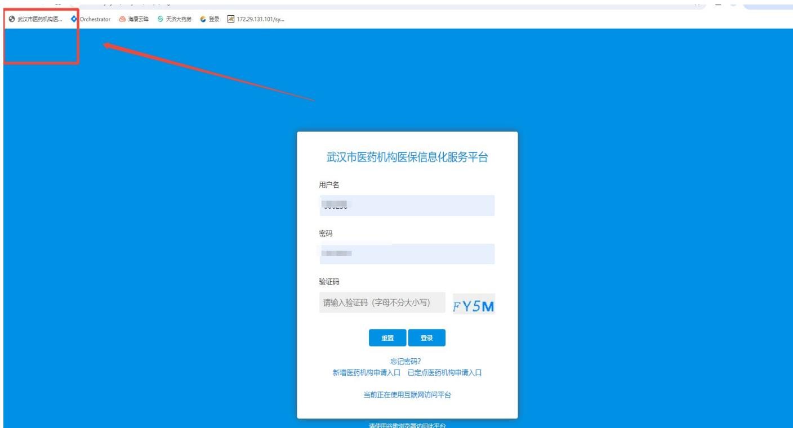

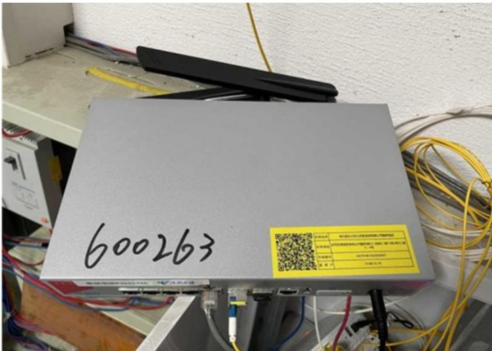

上图是医保光猫，注意黄色细光纤线不要拉扯或者打折，以防损坏光纤线。

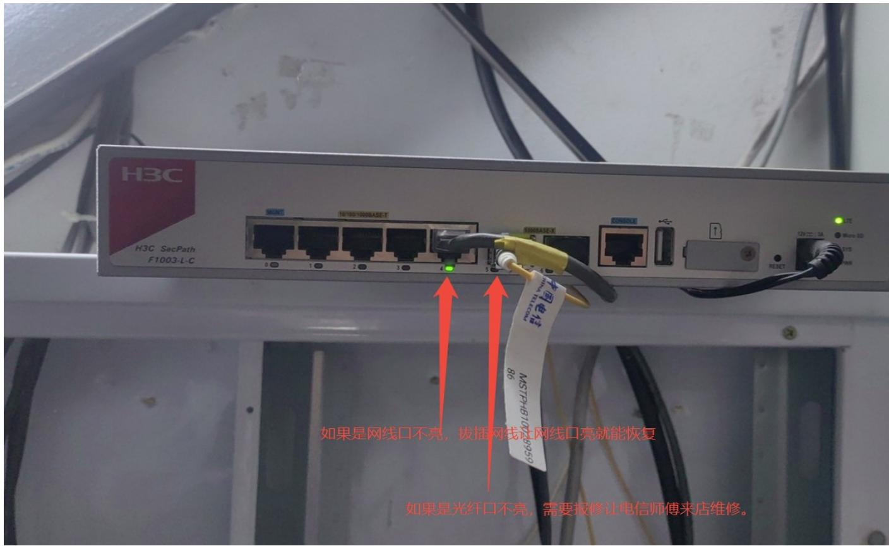

网口亮灯有可能需要拔插医保光猫这头网线口或者医保电脑主机背后那头网线口恢复亮灯。光纤口不亮灯需要电信维修并且没有备用方案。

四、两种光猫的黄色细线是尾纤线，里面是玻璃丝，不要打折扭曲或者暴力拉扯。

两种光猫维修的电信师傅一般不是同一个人，如果故障报修后沟通的电信师傅来电话分别登记好，记好是修普网的还是修医保的。